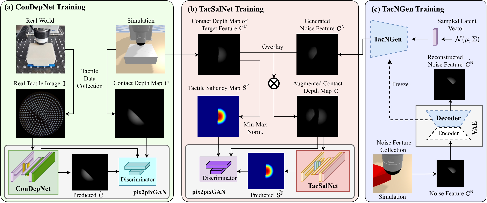

# Repository for Attention for Robot Touch: Tactile Saliency Prediction for Robust Sim-to-Real Tactile Control
[](LICENSE)


## In a nut shell
This repo, which is built on top of the [tactile_gym_sim2real](https://github.com/yijionglin/tactile_gym_sim2real), mainly contains code for 

1. Data collection: Collecting target feature and noise feature tactile images in simulation.
2. Training models: 
  a) a Contact Depth Network (ConDepNet), which generates a contact depth map to localize deformation in a real tactile image that contains target and noise features; 
  b) a Tactile Saliency Network (TacSalNet), which predicts a tactile saliency map to describe the target areas for an input contact depth map; 
  c) a Tactile Noise Generator (TacNGen), which generates noise features to train the TacSalNet. 
3. Demonstration Tools: A set of tools for demonstrating tactile saliency prediction.

*Top row: the tactile robot gets distracted by the noise stimuli and thus fails to achieve the edge-following task. Bottom row: the tactile robot is able to achieve the task thanks to tactile saliency prediction.*
<p align="center">
  
</p>
<br>

*Overview of the proposed 3-stage approach for tactile saliency prediction: (a) ConDepNet training for generating a contact depth map to localize deformation in a real tactile image using a dataset of paired real and simulated tactile images. (b) TacSalNet training to predict a tactile saliency map to capture a desired target feature for an input contact depth map with noise. (c) TacNGen training for generating noise features to train the TacSalNet.*:
<p align="center">
  
</p>
<br>


### Content ###
- [Installation](#installation)
- [Data Collection](#data-collection)
- [Contact Depth Network](#contact-depth-network)
- [Tactile Saliency Network](#tactile-saliency-network)
- [Tactile Noise Generator](#tactile-noise-generator)
- [Contributor](#contributor)
- [Bibtex](#bibtex)


### Installation ###
This repo has only been developed and tested with Ubuntu 18.04 and python 3.8.

```console
git clone https://github.com/yijionglin/tactile_saliency.git
cd tactile_saliency
python setup.py install
```


### Data Collection ###


With this repository, you are able to collect tactile images with edge target feature and noise feature for training a tactile saliency prediction network, which is detailed as follow:


**a) Tactile Images with the Edge Target Feature** 

*Note that you should install the [Tactile Gym](https://github.com/ac-93/tactile_gym) to run our code for the simulated robot.*

*Note that you should finish collecting the real tactile images before starting to collect simulated ones, as the simulated and real tactile images need to be matched up for later transfer model training.*

Navigate to the directory for sim tactile images collection,
```
cd tactile_saliency/tactile_gym_sim2real/data_collection/sim
```
Choose the contact features you would like to collect for tactile images. For example, for edge feature,
```
cd edge_2d
```
Run the script for data collection for edge,
```
python quick_collect.py
```


**b) Tactile Images with the Noise Feature** 

To improve the generalizability of the tactile saliency network, we use a generative model to
generate random noise tactile images for training the saliency predictor, which is called Tactile Noise Generator (TacNGen) and we detail the training process in [here](#tactile-noise-generator).

The noise tactile images should be saved in this directory
```
tactile_saliency/tactile_gym_sim2real/distractor_dev/data/edge_2d/distractor
```

### Contact Depth Network ###
Once both the sim and the real tactile images are collected, you are able to train a ConDepNet for predicting the contact depth from real tactile images. This training pipline is adapted from [tactile_gym_sim2real](https://github.com/yijionglin/tactile_gym_sim2real).


```
cd tactile_saliency/tactile_gym_sim2real/distractor_dev
```

Before training, it's always good to check the collected pairwise real and simulated tactile images by reviewing them for quality and consistency,

```
python demo_image_pairs.py
```

If the dataset looks good, then you can start to train a real-to-sim trasnfer by
```
python pix2pix_train.py
```

### Tactile Saliency Network ###


In the same directory, start training a tactile saliency prediction model by
```
python pix2pix_cycle_train.py
```


### Sim-to-Real Deep-RL Policy Application ###

*Note that before the sim-to-real application, you should already have an image transfer model for real-to-sim mapping obtained from previous steps and a deep-RL policy trained for a specific task using [Tactile Gym](https://github.com/ac-93/tactile_gym).*

Navigate to the directory for sim-to-real deep-RL policy application,
```
cd online_experiments
```

Before any sim-to-real application, it's always good to check the translation quality of the transfer model by
```
python test_gan.py
```

Choose the task you would like to play with; for example, if you want the robot to perform the edge-following task,


```
cd edge_follow_env
python evaluate_edge_follow.py
```


### Contributor ###

[Yijiong Lin](https://yijionglin.github.io/) (<ins>Currently looking for a PostDoc or Fellowship position starting around 2025 January</ins>)


### Bibtex ###

If you use this repo in your work, please cite

```

```
